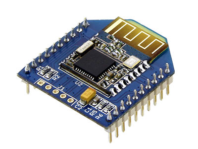
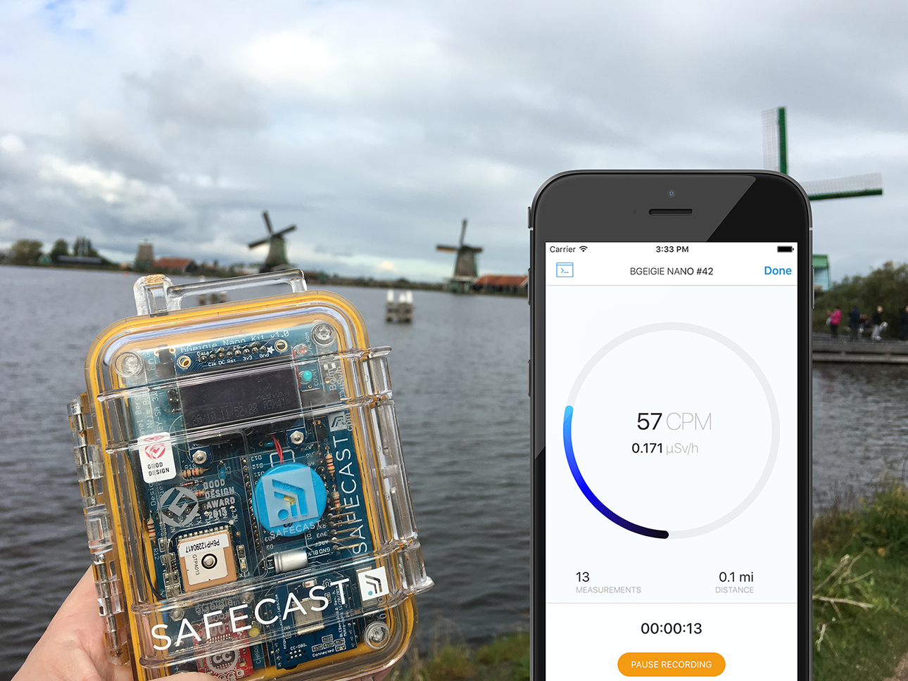

Safecast Drive iOS app
=======================

[]

Safecast Drive is an app that enables you to:

- Connect with your bGeigieNano (as long as you have the Bluetooth LE module installed) record data and upload them to the (https://api.safecast.org/ "Safecast API") directly. No need to remove your MicroSD card anymore!
- Access previous logs and update their status.

# Supported devices

In the current version only one Drivecast device is supported.

[]

Safecast Drive is compatible with the (http://blog.safecast.org/bgeigie-nano/ "bGeigieNano geiger counter") equipped with a (https://github.com/michaelkroll/BLEbee "BLEBee module").

[]

Other ressources about the BLE Bee module.
- (http://www.mkroll.mobi/?page_id=1834 "Dr Michael Kroll's blog")
- (http://www.seeedstudio.com/wiki/BLE_Bee "Seeed Studio wiki")
- (https://www.seeedstudio.com/depot/BLEbee-v20-p-2461.html "Where to buy it?")

### Technical details

This app is writen in swift 2.1 using the MVVM design pattern with some use of functional reactive programming.

### External tools and libraries

For external library management, we rely on CocoaPods. If you are not familiar with the process, please refer to the (https://cocoapods.org/ "documentation"):

- (https://github.com/Alamofire/Alamofire "Alamofire")
- (https://github.com/paiv/AngleGradientLayer "AngleGradientLayer")
- (https://github.com/Boris-Em/BEMSimpleLineGraph "BEMSimpleLineGraph")
- (https://cocoapods.org "Cocoapods")
- (https://github.com/hackiftekhar/IQKeyboardManager "IQKeyboardManager")
- (https://github.com/kevin-hirsch/KVNProgress "KVNProgress")
- (https://realm.io "Realm Swift")
- (https://github.com/raymondjavaxx/SpinKit-ObjC "Spinkit ObjC")
- (https://github.com/SwiftyJSON/SwiftyJSON "SnapKit")
- (https://github.com/Alamofire/Alamofire "SwiftyJSON")
- (https://github.com/AliSoftware/SwiftGen "SwiftGen")
- (https://github.com/ReactiveCocoa/ReactiveCocoa "ReactiveCocoa")

Most of the assets we use in the app for icons are generously provided by (https://icons8.com/ "Icons8") in support to our open-source initiative.

# Licenses we use

Licensing can be confusing. This is why we provide a (http://blog.safecast.org/faq/licenses/ "handy little guide") about what licenses we use and how we use them.

# Learn more about us

[]

Safecast is an international, volunteer-centered organization devoted to open citizen science for the environment. After the devastating earthquake and tsunami which struck eastern Japan on March 11, 2011, and the subsequent meltdown of the Fukushima Daiichi Nuclear Power Plant, accurate and trustworthy radiation information was publicly unavailable. Safecast was formed in response, and quickly began monitoring, collecting, and openly sharing information on environmental radiation and other pollutants, growing quickly in size, scope, and geographical reach. Our mission is to provide citizens worldwide with the tools they need to inform themselves by gathering and sharing accurate environmental data in an open and participatory fashion.

[]

For detailed information about the organisation:

- (http://safecast.org/tilemap/ "Access the map")
- (http://blog.safecast.org "Visit our blog")
- (http://blog.safecast.org/faq "Read our FAQ")

You can also watch an episode of the excellent video series called “The Power of Privacy” featuring Safecast at The Guardian online:

: Open data: mapping the fallout from Fukushima")
